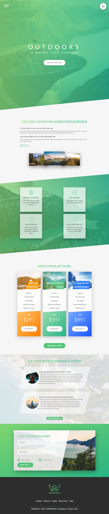

- visite Natours Website : https://safouane01.github.io/
# Description: 
This is a front-end website for an imaginary tour company that specializes in nature tours. The website provides visitors with an interactive platform to explore various nature tours, view tour details, prices, and ratings, and book their desired tours.

# Features: 

- **Tour Listings:** Discover a wide range of nature tours offered by the company. Each tour listing includes, tour duration, price, and average rating based on customer reviews.

- **Tour Details:** Dive deeper into the details of each tour. Explore comprehensive information such as the itinerary, tour highlights, activities, and any additional relevant information that potential participants may find useful. This allows visitors to get a complete understanding of what each tour offers.

- **Customer Ratings:** Gain insights from previous tour participants through customer ratings and reviews. Real-life experiences shared by customers provide valuable feedback and help potential customers make informed decisions based on the quality and satisfaction levels of each tour.

- **Tour Booking:** Book your desired tours directly through the website. An intuitive and user-friendly booking system allows visitors to select their preferred tour.

# Technologies Used:
 
 
  
 

# Preview: 
- Desktop Version: 

.png)
- Desktop Version (Active & hover -state): 

- Tablet Version: 

-Mobile Version: 

.png)

- for better visualization visite : https://safouane01.github.io/
